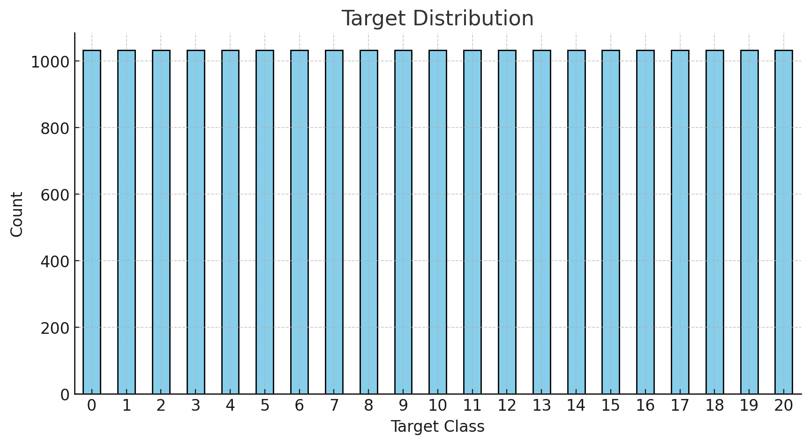
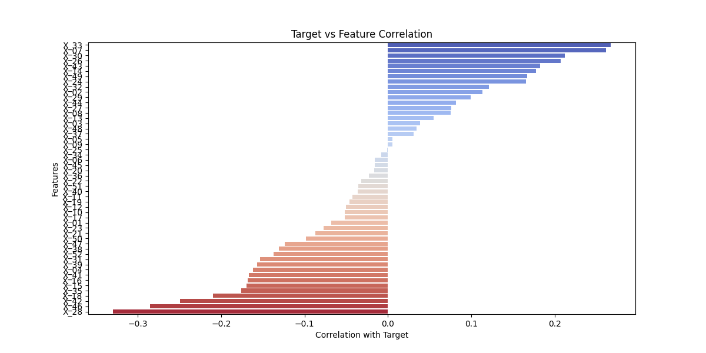
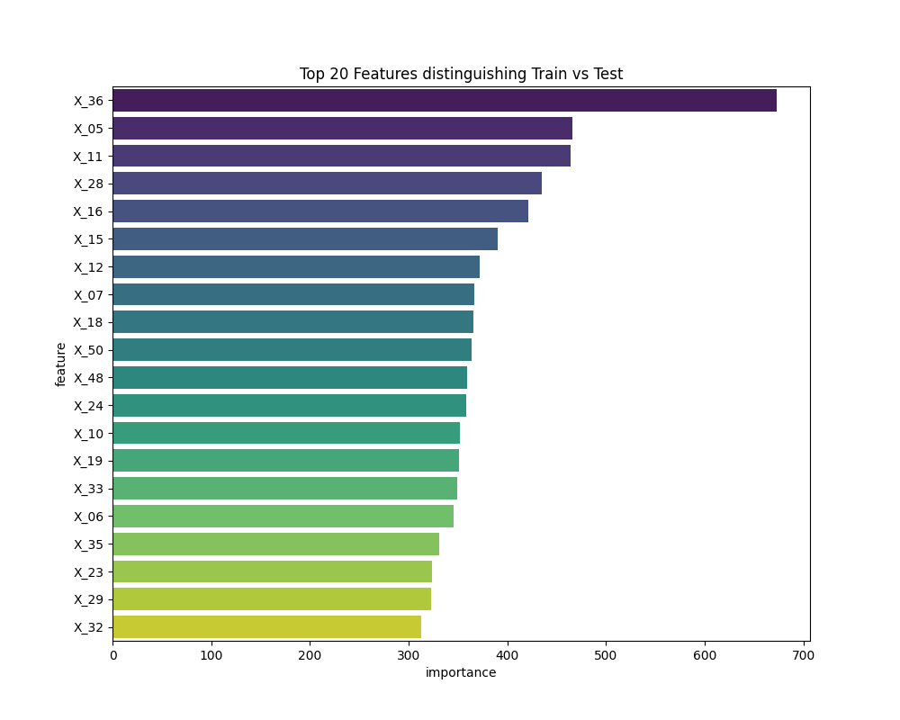
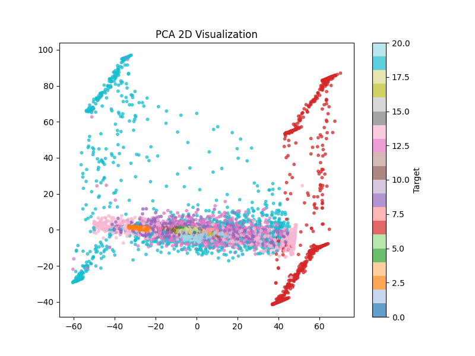
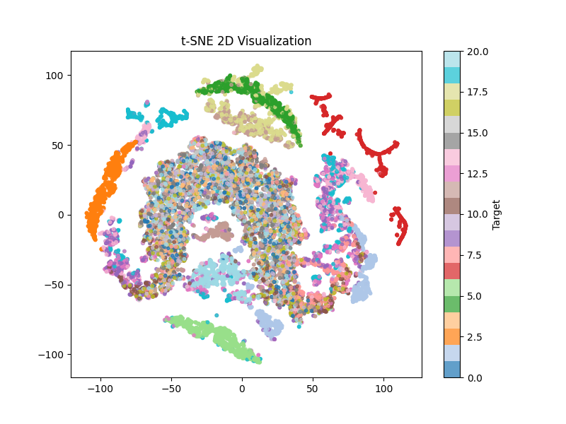
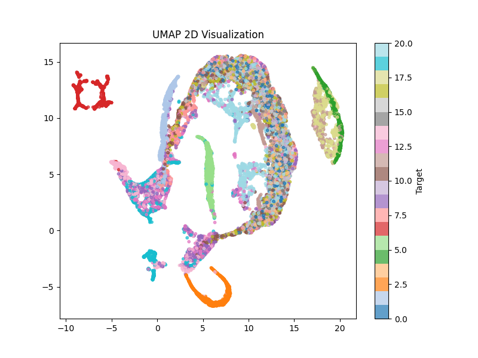
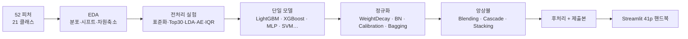

<div align="center">


### 📘 우리만의 AI 교과서 — 52피처·21클래스 분류 ML 핸드북

비식별 **52피처 · 21클래스 다중분류**를 해결하면서, 모델을 하나씩 직접 굴려보고
**Streamlit 교과서**로 정리한 41p 핸드북. EDA → 전처리 → 모델 → 정규화 → 결과까지
**모든 실험을 한 페이지로 비교**할 수 있게 만들었습니다.

<br/>


</div>

---

## 주요 내용

- **EDA 진단** — 타깃 21클래스 **불균형 정량화**, **train/test 분포 시프트** 탐지, PCA · t-SNE · UMAP **차원축소 군집** 확인.
- **전처리 실험 카탈로그** — 표준화 · Top-30 피처선택 · 상관 가지치기 · LDA 피처 · 오토인코더 잠재 · IQR / 이상치 정책 비교.
- **모델 페이지** — LightGBM · XGBoost · CatBoost · RandomForest · MLP · SVM · LDA-SVM · QDA · KNN · LogReg — **각 모델 1페이지**로 통일 (특징·하이퍼·강약점·실험기록).
- **정규화 페이지** — Weight Decay+EarlyStop · BatchNorm+Noise · Calibration · Bagging · Gating + 개요.
- **앙상블 / 결과** — Blending · Cascade · Stacking 변형 · 후처리 · 학습곡선 · 제출본 추적.
- **DACON 본선 진출** — 비식별 데이터·다중분류 트랙. 팀 프로젝트.

---

## 🖼️ EDA 미리보기

| 타깃 분포 — 21클래스 불균형 | 타깃·피처 상관 |
|:---:|:---:|
|  |  |
| **Train / Test 분포 시프트 탐지** | **PCA 2D 투영** |
|  |  |
| **t-SNE 2D 군집** | **UMAP 2D 군집** |
|  |  |

---

## 🔄 실험 흐름



---

## 🚀 빠른 시작

```bash
# 의존성 (요약)
pip install streamlit pandas numpy scikit-learn matplotlib seaborn \
            lightgbm xgboost catboost umap-learn \
            graphviz plotly scipy joblib

# 실행
streamlit run streamlit_app/app.py
# → 사이드바에서 EDA · 전처리 · 모델 · 정규화 · 결과 페이지를 클릭하며 탐색
```

---

## 🛠 기술 스택

| 영역 | 사용 기술 |
|---|---|
| **모델** | LightGBM · XGBoost · CatBoost · RandomForest · MLP · SVM · LDA-SVM · QDA · KNN · LogReg |
| **앙상블** | Blending · Cascade · Stacking 변형 |
| **전처리·차원축소** | StandardScaler · Top-K 선택 · 상관 가지치기 · LDA · Autoencoder · IQR / 이상치 정책 |
| **EDA·시각화** | pandas · matplotlib · seaborn · PCA · t-SNE · UMAP |
| **UI** | Streamlit (`views/` 페이지 레지스트리 패턴) |

---

## 📁 디렉토리 구조

```text
streamlit_app/
├── app.py                  진입점 — views/* 를 레지스트리에 import
├── core/                   기본 App · 페이지 베이스
├── views/
│   ├── home.py             대문
│   ├── eda_overview · eda_quality_target · eda_features_corr · eda_shift_dim_outlier
│   ├── preprocess_*        전처리 실험 페이지 (8종)
│   ├── lightgbm · xgboost · catboost · random_forest · mlp · svm · lda_svm · qda · knn · logreg
│   ├── regularization_*    정규화 페이지 (6종)
│   ├── blending · cascade  앙상블
│   ├── results_*           결과·학습곡선·후처리·제출본
│   └── model_references    참고문헌
├── assets/eda              EDA 이미지·플롯
├── data/samples            샘플 데이터
└── docs/flow               흐름 다이어그램

docs/
└── img/                    포트폴리오 미리보기 (target / corr / shift / pca / tsne / umap)
```

---

## ⚠️ 알려진 사항

- **DACON 본선 팀 프로젝트** — 본인 담당: EDA 진단(분포 시프트·차원축소), 일부 전처리·정규화 실험, Streamlit 핸드북 구조화.
- 비식별 데이터라 피처명·도메인 의미는 공개하지 않습니다 — 페이지는 **방법론 중심**으로 작성.
- 가중치 / 제출 CSV는 저장소에 포함하지 않습니다 (저작권·용량). `results_submissions.py` 는 메타데이터만 보여줍니다.

<div align="center">


</div>
